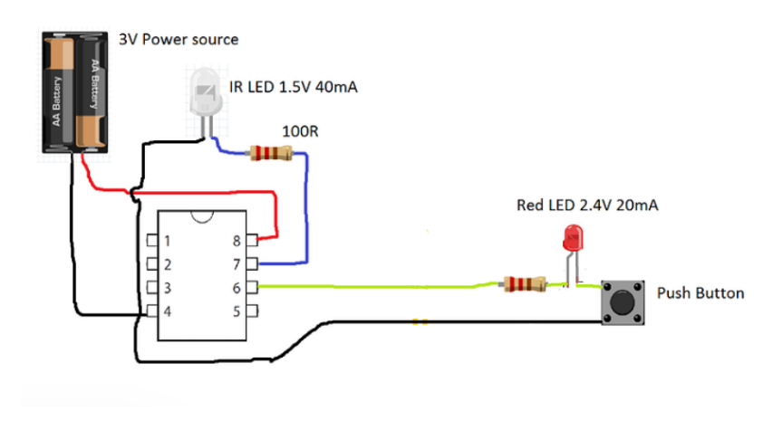

# Hack-Clubbing-Illuminated-Desk-Nameplate
its an  minimalist led illuminated desk nameplate designed for hackathon desks and coding spaces and tech clubs 

# Overview

Hack Clubbing is a minimalist LED-illuminated desk nameplate designed for hackathon desks, coding spaces, and tech clubs.
It uses edge-lit acrylic and a simple LED system to create a clean, professional glow while staying low-cost and easy to build.

This project focuses on simplicity, aesthetics, and real-world usability.

# What This Project Is

This project is a low-cost, DIY illuminated desk nameplate that can display a name, handle, or club identity. It uses laser-engraved acrylic and white LED edge lighting to create a clean lighting effect without requiring complex electronics or microcontrollers.

The design focuses on:

Minimalist visual style

Soft ambient illumination

Low power usage

Easy manufacturing & assembly

# How to Use the Nameplate

Using the nameplate is straightforward:

Connect the power source (USB or AA cell pack).

Toggle the mini switch to turn the LEDs on or off.

Place the nameplate on a desk, hackathon table, or workspace.

Once powered, the engraved acrylic diffuses light from the edges, producing an elegant glowing text effect.

# Why This Project Was Made

This project was created to design something that is:

Useful in real-world hackathon and coding setups

Visually clean and modern

Budget-friendly and beginner-safe

Simple to build without advanced electronics

Hackathons and tech clubs often lack small but meaningful identity elements on desks. This nameplate adds personality, visibility, and aesthetic appeal while staying inexpensive and easy to reproduce.

| Item           | Description                              | Quantity | Unit Cost (USD) | Total Cost (USD) | Notes                           |
| -------------- | ---------------------------------------- | -------- | --------------- | ---------------- | ------------------------------- |
| Acrylic Sheet  | 3mm clear acrylic sheet (laser engraved) | 1        | 8.90            | 8.90             | Engraved text for nameplate     |
| LED Strip      | 5V white LED strip (30–50cm)  with AA cell            | 1        | 3.74            | 3.74             | Edge lighting                   |
| Switch         | Mini on/off toggle switch                | 1        | 3.30            | 3.30             | Power control                   |
| USB Cable      | USB-A to 5V power cable                  | 1        | 2.63            | 2.63             | Power source                    |
| Resistor       | 220Ω resistor                            | 1        | 1.33            | 1.33             | Required if using discrete LEDs |
| Wires          | Hook-up wires (assorted)                 | 1 set    | 1.76            | 1.76             | Internal connections            |
| Fasteners      | Small screws , adhesive and color tapes                 | 1 set    | 1.60            | 1.60            | Assembly hardware               |
| Online Fee  | Fee by Flipkart            | 1    | 1.64            | 1.64             | Cart Fee               |
| **TOTAL**      |                                          |          |                 | **24.9 USD**    | Within $25 budget               |

# Features

Minimalist design

Soft LED glow (edge-lit acrylic)

Low power consumption (AA cell powered)

Easy to manufacture and assemble

Beginner-friendly electronics (no microcontroller)

## Wiring Diagram 

## Total Bill of Cart

## 🖼️ Design Images

### Front View
.png)

### Side View
.png)

.png)
